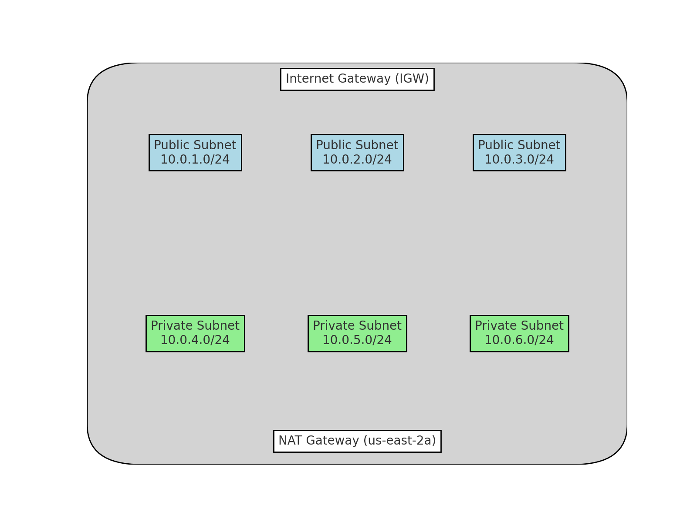

# Criação de VPC com Terraform

Este código em Terraform cria uma Virtual Private Cloud (VPC) na região `us-east-2` da AWS com subnets públicas e privadas. Para otimizar os custos, um único NAT Gateway é compartilhado entre todas as subnets privadas. A infraestrutura inclui:

- Uma VPC com um bloco CIDR de `10.0.0.0/16`
- 3 subnets públicas, cada uma em uma Zona de Disponibilidade (AZ) diferente
- 3 subnets privadas, cada uma em uma AZ diferente
- 1 Internet Gateway para acesso à internet nas subnets públicas
- 1 NAT Gateway para fornecer acesso à internet às subnets privadas
- Tabelas de rotas públicas e privadas para roteamento do tráfego

## Diagrama da Topologia



## Índice
- [Criação de VPC com Terraform](#criação-de-vpc-com-terraform)
  - [Diagrama da Topologia](#diagrama-da-topologia)
  - [Índice](#índice)
  - [Requisitos](#requisitos)
  - [Visão Geral da Arquitetura](#visão-geral-da-arquitetura)
  - [Uso](#uso)
    - [Estrutura dos Arquivos](#estrutura-dos-arquivos)
  - [Otimização de Custos](#otimização-de-custos)
  - [Saídas](#saídas)

## Requisitos

- AWS CLI configurada com acesso necessário
- Terraform v1.0 ou superior
- Conta AWS com permissões para criar VPCs, subnets e gateways

## Visão Geral da Arquitetura

- **VPC**: Uma rede virtual com um bloco CIDR de `10.0.0.0/16`
- **Subnets**: 
  - Subnets públicas (`10.0.1.0/24`, `10.0.2.0/24`, `10.0.3.0/24`) nas AZs `us-east-2a`, `us-east-2b` e `us-east-2c`
  - Subnets privadas (`10.0.4.0/24`, `10.0.5.0/24`, `10.0.6.0/24`) nas mesmas AZs
- **Internet Gateway**: Fornece acesso à internet para as subnets públicas
- **NAT Gateway**: Um único NAT Gateway compartilhado entre todas as subnets privadas
- **Tabelas de Rotas**: Tabelas de rotas públicas e privadas para gerenciar o tráfego de rede

## Uso

1. Clone o repositório ou copie os arquivos de configuração para o seu diretório de trabalho:
   ```bash
   git clone <repository-url>
   cd vpc-terraform
   ```

2. Inicialize o Terraform:
   ```bash
   terraform init
   ```

3. Aplique a configuração para criar a VPC e seus recursos:
   ```bash
   terraform apply
   ```

4. Confirme a criação dos recursos digitando `yes` quando solicitado.

### Estrutura dos Arquivos

- `provider.tf`: Define o provedor da AWS e a região
- `vpc.tf`: Cria a VPC e gera a saída do ID da VPC
- `internet_gateway.tf`: Cria o Internet Gateway e a tabela de rotas públicas
- `subnets.tf`: Define as subnets públicas e privadas
- `nat_gateway.tf`: Cria um único NAT Gateway e as tabelas de rotas associadas
- `route_association.tf`: Associa as subnets às tabelas de rotas corretas

## Otimização de Custos

Para reduzir custos, um único NAT Gateway é usado para todas as subnets privadas, em vez de um por Zona de Disponibilidade. Isso pode economizar custos significativos em ambientes onde alta disponibilidade em todas as zonas não é uma exigência crítica.

- **NAT Gateway**: Um dos principais pontos de otimização de custos. A AWS cobra por NAT Gateways, e um único NAT Gateway pode atender ao tráfego de todas as subnets privadas em diferentes AZs.

## Saídas

Após aplicar a configuração do Terraform, os seguintes valores serão exibidos:

- `vpc_id`: O ID da VPC criada
- `public_subnets`: Os IDs das subnets públicas
- `private_subnets`: Os IDs das subnets privadas
